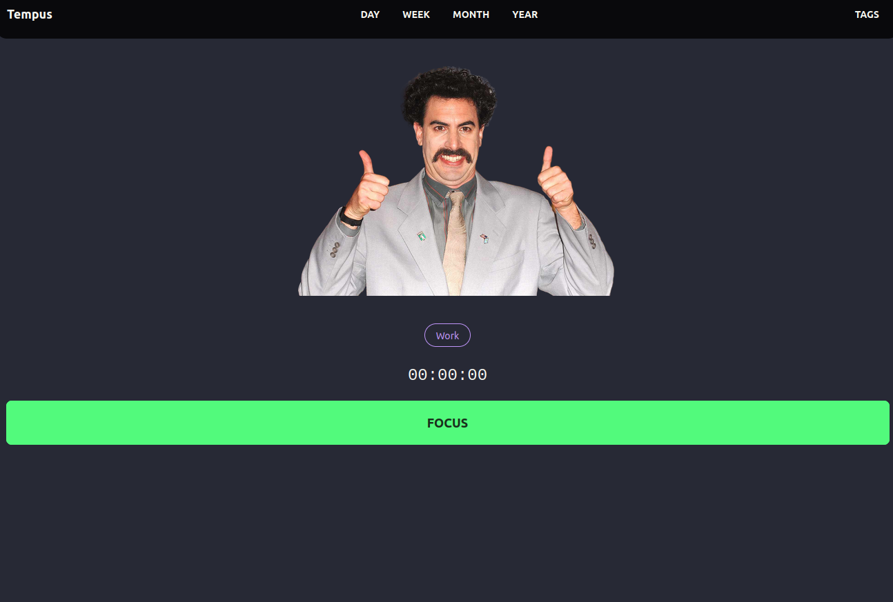

# 🚀 Boost Your Productivity with our Self-Hosted Study Tracker! 📚

Are you tired of constantly juggling different productivity apps, only to find none of them truly cater to your study needs? Look no further – we're thrilled to introduce our powerful Self-Hosted Study Tracker, designed to revolutionize your study routine and help you excel like never before.




# 🌟 Why Choose Our Self-Hosted Study Tracker?

✅ Total Control: Hosting your own instance means you're in complete control of your data. No more worries about your information being stored on external servers – it's all on your terms.

✅ Tailored to You: Our study tracker is fully customizable to fit your unique workflow. From session durations and study goals to advanced analytics, everything can be tailored to meet your preferences.

✅ Privacy Matters: Your study data is sensitive – that's why our self-hosted solution ensures your information remains private and secure at all times.

✅ Community Support: Join a vibrant community of like-minded learners and enthusiasts. Share tips, tricks, and ideas to enhance your study strategy even further.


# Installation Guide

Discover seamless ways to install and unleash the potential of our productivity manager on your server. Choose the method that suits you best and take control of your study routine like never before.

## Docker Installation

1. **Retrieve the Latest Docker Image**

   Open your terminal and enter:

  ```sh
  docker pull satoridigital/tempus:latest
  ```

2. **Configure a docker-compose file**

  ```yaml
  version: '3'
  services:
    app:
      image: satoridigital/tempus:latest
      ports: 
        - '9111:9111'
      volumes:
        - './data:/data'
      restart: unless-stopped
  ```

3. **Run & Enjoy**

  ```sh
  docker-compose up
  ```


alternatively if you want to run on homeserver in daemon mode

```sh
docker-compose up -d
```

### Build from source


1. Clone the repo
```sh
git clone https://github.com/TrevorSatori/tempus.git
```

2. change directory to the repo
```sh
cd tempus
```

3. Install the dependencies
```sh
npm install
```

4.build an optimized version of the project
```sh
npm run build
```

5. run and enjoy 
```sh
npm run start
```


## Analytics


## Customizable


