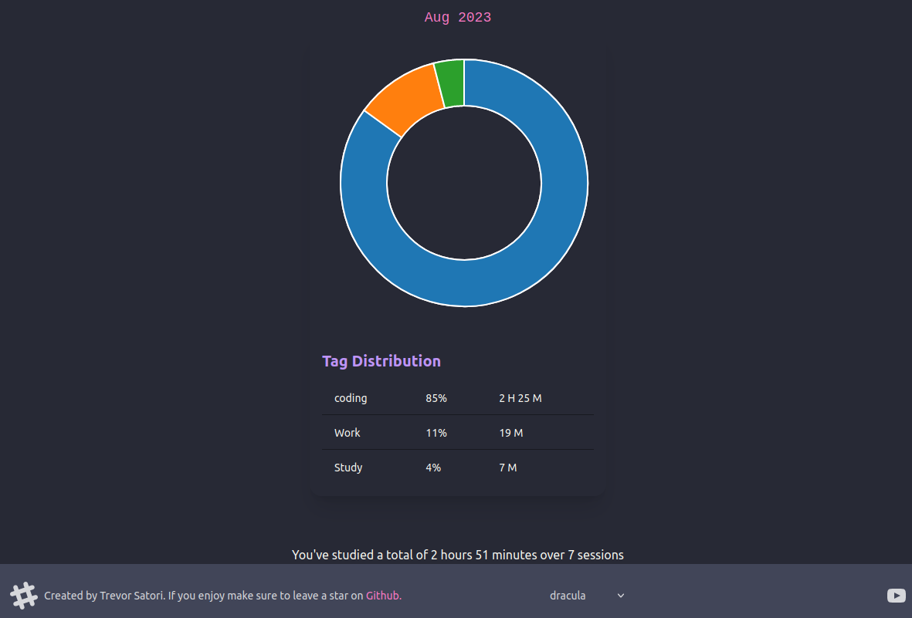

# Tempus: Self Hostable Productivity Manager


Wowoweewah, what is this? Download and make life great success!

# Install

> There are several options to install this repo.

### Docker Install


1. Get the latest docker image

```sh
docker pull satoridigital/tempus:latest
```

2. Configure a docker-compose file

```yaml

version: '3'
services:
  app:
    image: satoridigital/tempus:latest
    ports: 
      - '9111:9111'
    volumes:
      - './data:/data'
    restart: unless-stopped
```

3. run and enjoy

```sh
docker-compose up
```

alternatively if you want to run on homeserver in daemon mode

```sh
docker compose up -d
```

### Build from source


1. Clone the repo
```sh
git clone https://github.com/TrevorSatori/tempus.git
```

2. change directory to the repo
```sh
cd tempus
```

3. Install the dependencies
```sh
npm install
```

4.build an optimized version of the project
```sh
npm npm run build
```

5. run and enjoy 
```sh
npm npm run start
```


## Analytics




## Customizable


